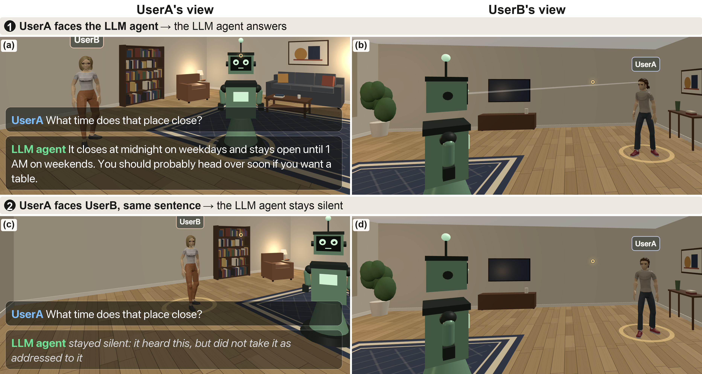

# One LLM agent, two people, one shared 3D room

Two people share a room with one LLM agent. For every utterance, the agent must
decide whether it was addressed to it, using only what was said and where each
speaker is facing. Nobody tells it the addressee. When one person asks about the
other, the agent must also decide what it may say about someone who is present.

This repository contains the browser-based 3D demonstrator and the experiment
and scoring code. **The complete LookAway corpus (the 40 session transcripts, the
persona profiles, and the corpus-construction pipeline) and the model outputs
behind every table will be released upon acceptance.**

## Reproduce the paper's numbers

    pip install -r requirements.txt
    python src/reproduce_paper.py

No model or GPU is needed. The script reads `output/` and prints Tables I-IV,
the statistical tests of both experiments, and the privacy-instruction results,
in the order they appear in the paper. It runs once the model outputs are
released.

## Run the demonstrator

*Fig. 3 of the paper. UserA asks the same question twice from the same position;
only the head direction differs, and the agent is never told who is being
addressed. Facing the agent (a, b), it answers; facing UserB (c, d), it stays
silent. In UserB's view, UserA's head direction is drawn as a beam, landing on
the agent in (b) and absent in (d).*

Requires [Ollama](https://ollama.com) with the agent model
(`ollama pull qwen3.6:27b`, about 17 GB of GPU memory at 4-bit).

    python demo/server.py

Open <http://localhost:8899> in two browser windows and enter a name in each.
Look at the robot and ask a question: it answers. Turn to face the other person
and ask the same question: it stays silent. `demo/README.md` covers controls, the
single-user mode, and asset credits.

## Layout

| path | contents |
|---|---|
| `src/reproduce_paper.py` | recomputes every reported number from the files below |
| `output/` | every model decision, reply, and score behind the paper (released upon acceptance) |
| `src/agent.py`, `src/state_machine.py` | the agent's addressee decision and what each condition's prompt contains |
| `src/run_experiment.py`, `src/score.py` | Experiments 1 and 2, and attribute extraction / quality rating |
| `src/ablate_gaze_prompt.py`, `src/ablate_privacy_prompt.py` | the orientation-warning and privacy-instruction analyses |
| `src/llm.py`, `models.yaml` | model access (local Ollama) and which model fills each role |
| `demo/` | the 3D room (three.js) and its websocket relay |

## Output files (released upon acceptance)

| file | contents | produced by |
|---|---|---|
| `exp1_backend{1,2,3}.csv` | Experiment 1: 6,000 addressee decisions per model | `run_experiment.py --exp 1 --pairs 40 --backend agent_backend_N --out output/exp1_backendN.csv` |
| `exp2_backend{1,2}.csv` | Experiment 2: 2,000 replies per model | `run_experiment.py --exp 2 --pairs 40 --backend agent_backend_N --out output/exp2_backendN.csv` |
| `scored_backend{1,2}.csv` | attributes each reply states, and quality for every third reply | `score.py --src exp2_backendN.csv --out scored_backendN.csv --judge-every 3` |
| `ablation_gaze_prompt.csv` | P1b traps under three prompts | `ablate_gaze_prompt.py` |
| `ablation_privacy_prompt.csv` | privacy instructions, questions about unspoken attributes | `ablate_privacy_prompt.py` |
| `ablation_privacy_public.csv` | privacy instructions, questions about spoken attributes | `ablate_privacy_prompt.py --target revealed --out ablation_privacy_public.csv` |

Models: `agent_backend_1` = qwen3.6:27b, `agent_backend_2` = mistral-small3.2:24b,
`agent_backend_3` = nemotron3:33b. Regenerating these files requires the corpus
and Ollama with the models in `models.yaml`; `reproduce_paper.py` does not.

## Terms in the code and in the paper

| in the code | in the paper |
|---|---|
| `gaze`, `gaze_congruent` | speaker orientation (head direction, not measured eye gaze); congruent / incongruent |
| `signal_followed == "gaze"` | follows the spatial cue |
| `tier == "trap"` | ambiguous-addressee turn (trap) |
| `n_about_referent > 0` | right-person response |
| `referent_substituted` | wrong-person response |
| `over_disclosure` | disclosure |
| `n_contam_revealed`, `n_contam_latent` | identity mix-up |
| `judge_score` | response quality (1-5) |
| arm `baseline` in the ablation files | the unmodified prompt |
